Inglés: [README-EN.md](README-EN.md)

# Agentes de IA: Seguridad y Riesgos
Proyecto educativo y de demostración diseñado para entender cómo cambia la seguridad cuando un sistema pasa de ser determinista a convertirse en un agente capaz de planificar, ejecutar herramientas y tomar decisiones con autonomía acotada.

Este repositorio no pretende sustituir una arquitectura real de producción, sino ilustrar, con ejemplos sencillos en C# y .NET, los principios clave de seguridad para agentes de IA: validación de objetivos, alcance de plan, control de herramientas, trazabilidad y revisión humana.

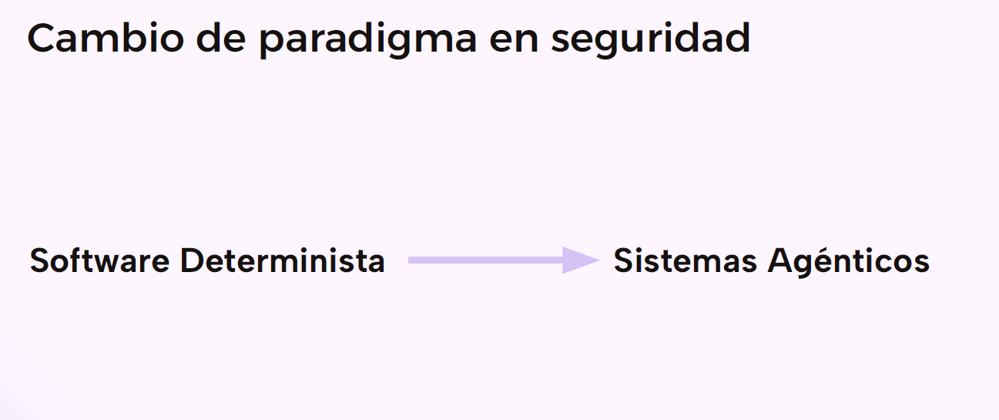

Para este contenido, cuando diga sistema agéntico me refiero al software que no solo responde sino que recibe un objetivo, planifica pasos intermedios, usa herramientas y ejecuta acciones con autonomía acotada por políticas. Esa autonomía acotada es exactamente donde cambian los riesgos. 

## ¿Por qué este proyecto?

En software tradicional, la seguridad se centra en validar entradas, controlar flujos deterministas, autenticar usuarios y autorizar acciones. En una arquitectura agéntica, además de esas capas, aparece una nueva dimensión:

- el agente interpreta objetivos;
- genera un plan dinámico;
- selecciona herramientas;
- almacena contexto o memoria;
- ejecuta acciones con cierto nivel de autonomía.

Eso introduce riesgos compuestos: una acción individual puede parecer legítima, pero la combinación de pasos, contexto y objetivos puede terminar generando un resultado inseguro.

La idea central del repositorio es mostrar que seguridad en agentes no es solo un problema de prompt o de modelo. Es un problema de arquitectura, gobernanza, control de permisos y auditoría.

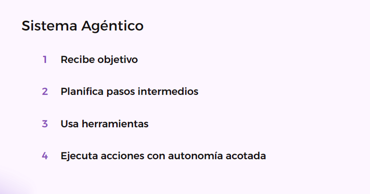

En el modelo tradicional, el foco estaba en controles conocidos, validar entradas y salidas, autenticar, autorizar y manejar errores. Había incertidumbre, sí, pero el comportamiento era más acotado, eso permitía diseñar pruebas y controles con una cobertura razonable sobre rutas de ejecución esperadas. 

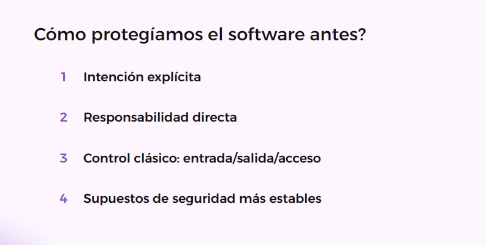

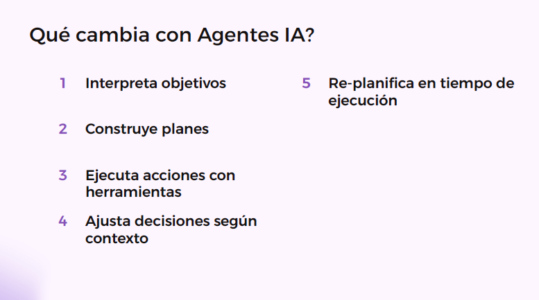

Con agentes, aparece una nueva capa. Hay interpretación de intención, planificación dinámica, uso de herramientas y ajuste por contexto. En ese proceso, surgen riesgos compuestos. 
Por ejemplo, cada paso por separado puede parecer válido, pero la combinación final puede ser insegura. 
Por eso, además de validar código, tenemos que gobernar decisiones y capacidades en tiempo de ejecución. 
Lo que estamos viendo es un cambio del modelo de confianza. 

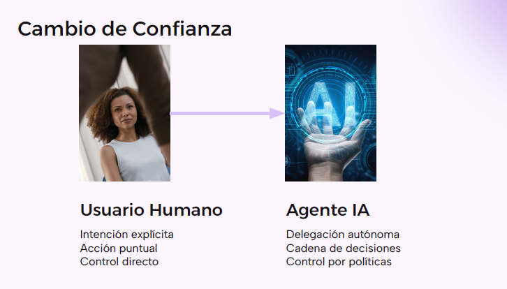

Con una persona usuaria, la intención suele estar más explícita y hay responsabilidad directa en cada acción. 
Con un agente, delegamos ejecución, entonces la pregunta técnica ya no es solo ¿puede hacer esto? Sino en qué condiciones lo puede hacer, con qué límites y cómo lo detenemos si se desvía. 
Aquí entran controles que vamos a usar durante todo el contenido. Estamos hablando de límites de agencia, privilegio mínimo efectivo, validación de plan antes de ejecutar, trazabilidad de decisión a acción y mecanismos de contención. 
No vamos a reemplazar nunca la seguridad clásica, simplemente vamos a complementarla donde la agencia introduce un riesgo sistémico. Cuando el sistema pasa de ejecutar a decidir, cambia la forma de atacarlo y también la forma de defenderlo.

### Paradigma determinista vs agéntico en la práctica

Vamos a ver en código lo que acabamos de ver en conceptos.

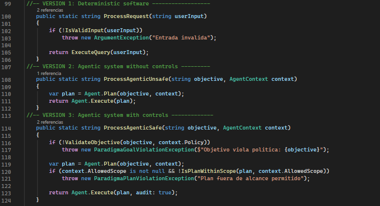

Tengo tres versiones del mismo problema, una versión determinista, una versión agéntica sin ningún tipo de control y una versión agéntica con controles. 
La diferencia no está en la cantidad de líneas de código, sino en qué punto el sistema toma las decisiones por sí solo. 
La primera versión es la versión determinista. Como puedes ver, recibe un input, hace una validación y luego ejecuta una query. El flujo siempre sigue el mismo camino, si la validación pasa, hay una sola ruta posible. Eso hace que los controles sean predecibles: valido la entrada, manejo los errores, autorizo. 
Veamos ahora la versión dos, que es la versión agéntica sin ningún tipo de control. Aquí tenemos el mismo objetivo, en este caso estamos hablando de un sistema que ofrece reembolsos. El agente puede ejecutar planes distintos en diferentes corridas, que cuando se está ejecutando ese plan no sabemos exactamente qué es lo que el agente va a definir, digamos. A veces puede hacer una ruta normal en donde va a buscar el pedido y va a encontrar un problema; o a lo mejor va a hacer una ruta más riesgosa donde va a dar un reembolso completo sin ningún tipo de verificación. Como no estamos haciendo ninguna validación sobre este plan, ambas pueden ejecutarse posiblemente. 
Veamos ahora la tercera versión. Esta sigue siendo una versión agéntica, pero hemos añadido una serie de controles. Lo primero que hacemos es validar el objetivo contra la política antes de planificar. Lo siguiente que hacemos es validar si los pasos del plan están permitidos, fíjate que el primero que vamos a hacer es pedirle al agente que ejecute un plan y luego verificar que estén permitidos. Algo que podríamos, por ejemplo, bloquear en este punto es que se haga un reembolso completo sin haber hecho una verificación previa por ejemplo.
Finalmente, lo que vamos a hacer es ejecutar el plan de este agente, pero le vamos a pasar un flag, por ejemplo, `audit=True`, para dejar trazabilidad de qué plan ha sido ejecutado y qué plan no ha sido ejecutado. 
Te voy a mostrar una ejecución de este código, algo que quiero que sepas es que la implementación de este agente está aquí arriba en este archivo, y lo que estamos haciendo aquí es que de forma aleatoria dentro del plan estamos escogiendo diferentes opciones que se pueden hacer como, por ejemplo, dar un reembolso, mirar la política o dar el reembolso sin ningún tipo de chequeo. 
Obviamente, el tipo de agente al que tú estás acostumbrado a escuchar digamos últimamente es aquel que interactúa con un LLM. En este caso, como quiero enfocarme solo en la parte de seguridad, no introduje la parte del LLM y así añadimos esa parte como de inestabilidad o de comportamiento diferente en cada ejecución. 

Si te muestro la ejecución de este programa, lo que tenemos acá abajo,
lo que va a pasar es que se va a hacer una llamada al modelo determinista, una al sistema agéntico sin controles y una al sistema agéntico con controles. 
Vamos a ejecutar esto y vas a ver en este caso que lo que estamos haciendo es que tenemos el pedido 123 y en el modelo determinista la respuesta fue siempre la misma. En el modelo agentico sin controles, lo que se intentó ejecutar aquí fue dar un reembolso, dar un reembolso sin ningún tipo de chequeo, que sabemos que esto no es algo que nos gustaría hacer en este caso.
Y en el tercer caso, donde sí tenemos controles, fíjate que aquí hubo un par de bloqueos porque probablemente se intentó hacer un reembolso sin ningún tipo de chequeo. 

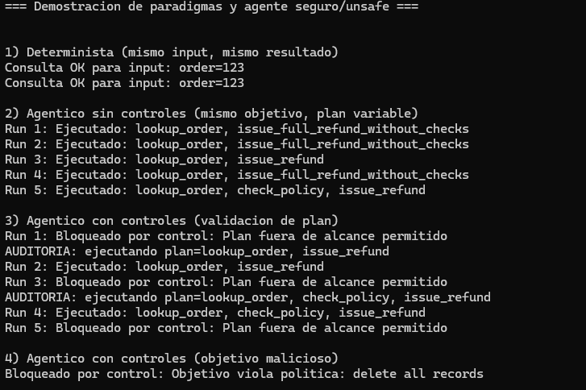

Si volvemos a ejecutar este código, vemos que obtenemos una ejecución diferente, de ahí el tema del comportamiento aleatorio para el ejemplo y vemos que se ha hecho algún tipo de de auditoría, esto es el flag que estábamos pasando de `audit=True`.

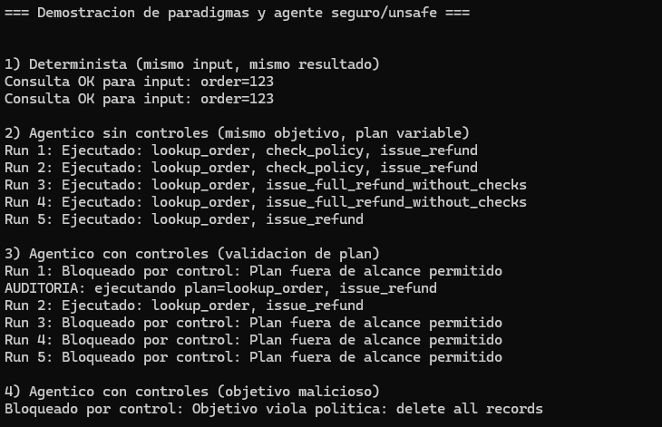

De todas formas, este código lo tienes disponible en el repositorio para que puedas explorarlo por ti mismo.
[Code](Agentes-IA-Seguridad-Riesgos\Agentes-IA-Seguridad-Riesgos\Paradigma.cs)

### Anatomía de un agente en 5 pasos

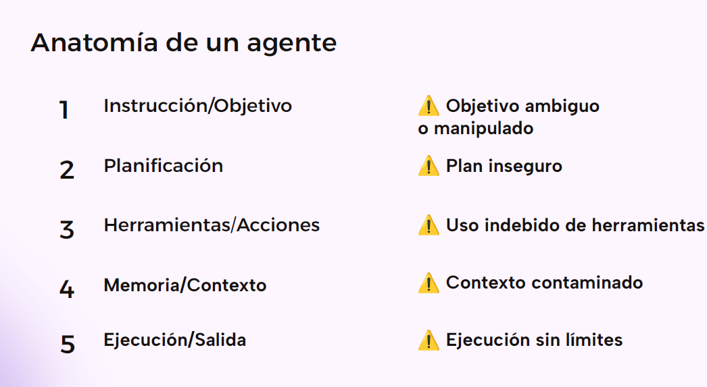

A continuación, vamos a analizar los riesgos de forma consistente y vamos a utilizar los cinco pasos del ciclo de vida de un agente. 
Todo empieza cuando entra una solicitud. Si ese objetivo llega ambiguo, conflictivo o manipulable, el resto del flujo nace torcido. 

El primer control es normalizar el objetivo, resolver cualquier tipo de ambigüedad y validarlo contra políticas antes de que el agente empiece a planificar. 
Luego pasamos al proceso de planificación, el agente arma un plan. Aquí el riesgo no es solo un plan malo, sino también la combinación de pasos no autorizados o sin límites. 
El control mínimo que puedes tener aquí es validar ese plan, precondiciones por cada paso y límites de alcance para evitar planes que se expandan solos. 

El tercer paso es el uso de herramientas. Aquí es donde vienen las llamadas a API, funciones o servicios externos. Este punto es crítico porque se pueden utilizar parámetros peligrosos, se pueden hacer acciones irreversibles y se puede usar fuera de contexto. 
El control mínimo que tienes que añadir aquí es una lista permitida de herramientas, validación semántica de los parámetros y privilegio mínimo por llamada. 

Luego pasamos a la parte de memoria o contexto, el agente decide con este contexto. Si el contexto está contaminado o no verificado, la decisión también lo va a estar. El control mínimo que puedes tener aquí es etiquetar confianza de las fuentes, caducar un contexto antiguo y separar memoria confiable de memoria no confiable. 

Finalmente cuando hablamos de la ejecución y la salida, aquí es donde puede haber un riesgo de alto impacto. El control mínimo que puedes hacer aquí es tener políticas por cada nivel de impacto, supervisión humana de decisiones críticas y trazabilidad completa de decisión, acción y resultado.
Por ejemplo, si hay algún tipo de acción crítica, algo que puedes hacer es algo conocido como human-in-the-loop, en donde antes de que el agente ejecute esa acción debe un humano intervenir para aprobarla o rechazarla.

### Los 5 pasos de un agente en la práctica

Permíteme mostrarte cómo se ve este mapa de cinco pasos de un agente en el código. [Code](Agentes-IA-Seguridad-Riesgos\Agentes-IA-Seguridad-Riesgos\PasosAgent1_5.cs)

En este caso tengo dos clases, una se llama AgentUnsafe y la otra se llama AgentSafe. 
La primera ejecuta los cinco pasos sin ningún tipo de control y la segunda tiene exactamente un control por paso. Vamos a mirarlo juntos. 

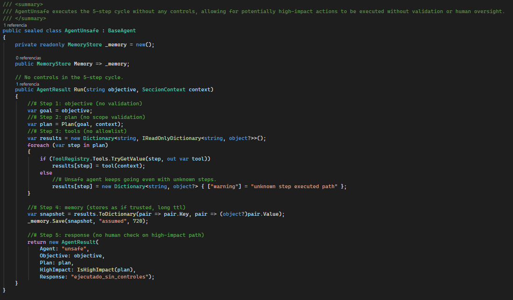

En el paso 1, si vemos aquí el método run del AgentUnsafe, la instrucción que estamos pasando aquí va directamente al plan sin ningún tipo de validación.
Luego, en la planificación, el plan se construye y se usa directamente. No hay ningún tipo de restricción sobre él.
Luego procedemos a usar una lista de herramientas que tenemos aquí guardadas en nuestra variable tools, y aquí el agente puede llamar a cualquier herramienta con cualquier parámetro y, en este caso, el agente unsafe continúa así haya un paso que desconoce. 
En el paso 4, cualquier resultado se guarda como contexto confiable. 
Y en el paso 5, la salida se devuelve directamente al usuario. 

Miremos ahora nuestro AgentSafe como contraste.

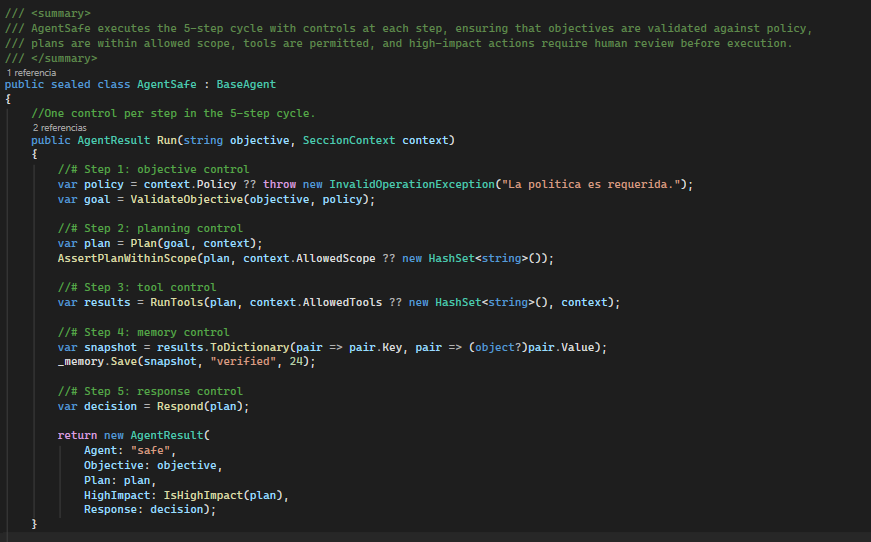

Fíjate que aquí lo primero que tenemos son una serie de métodos helpers que vamos a poder utilizar en nuestro método run. Como ves, lo primero que vamos a hacer en nuestro método run es validar el objetivo contra la política del sistema. 
Si esta validación no pasa, el agente no va a llegar ni siquiera a planificar, entonces el riesgo queda bloqueado directamente en este paso. 

El siguiente paso sería planificación, y aquí lo que hacemos es que en el método `assert_plan_within_scope` verificamos el plan contra el scope permitido antes de avanzar. 
Un plan que intenta expandirse más allá de lo autorizado queda detenido aquí. 

Procedemos ahora al uso de herramientas. Aquí vamos a ver que tenemos el método `run_tools`, y si nos metemos aquí hay un `allowed list` explícito, estamos diciendo exactamente qué herramientas puede utilizar este agente. 
Si la herramienta no está en esa lista, la llamada nunca va a ocurrir sin importar lo que el agente haya planeado. 

En el paso número 4, la memoria tiene nivel de confianza. El agente no decide sobre datos no verificados y el contexto viejo no contamina las decisiones futuras. 
Además, estamos añadiendo un tiempo de vida, en este caso, de 24 horas, entonces estamos limitando por cuánto tiempo este agente puede confiar en esta información. Y finalmente tenemos la respuesta. 
Si el impacto es alto, la respuesta espera aprobación humana antes de salir. Lo podemos ver aquí en el método `respond`, vemos que si es de alto impacto vamos a devolver, en este caso, que requiere versión humana y vamos a devolver un error. 
Es decir, que el agente no es el último punto de decisión en acciones de alto impacto. Como bien te comenté en el ejemplo anterior, este ejemplo se enfoca directamente en los pasos de ejecución de un agente y no 100 % en la parte autónoma y de interacción con una LLM de un agente. 

Lo que quiero que entiendas es que, a pesar de que el agente es autónomo y ejecuta un plan y hace todo ese tipo de cosas por su cuenta, todavía nosotros tenemos una serie de controles que podemos ejecutar para que estas ejecuciones sean seguras.

# OWASP Top 10 para aplicaciones agénticas

A continuación, quiero que hablemos de los riesgos más importantes en los sistemas agénticos según OWASP.

### Riesgo 1: Cambiando el comportamiento de un agente

Vamos a empezar por el cambio de comportamiento de un agente. 
El agent behavior hijack es uno de los diez riesgos definidos por OWASP..

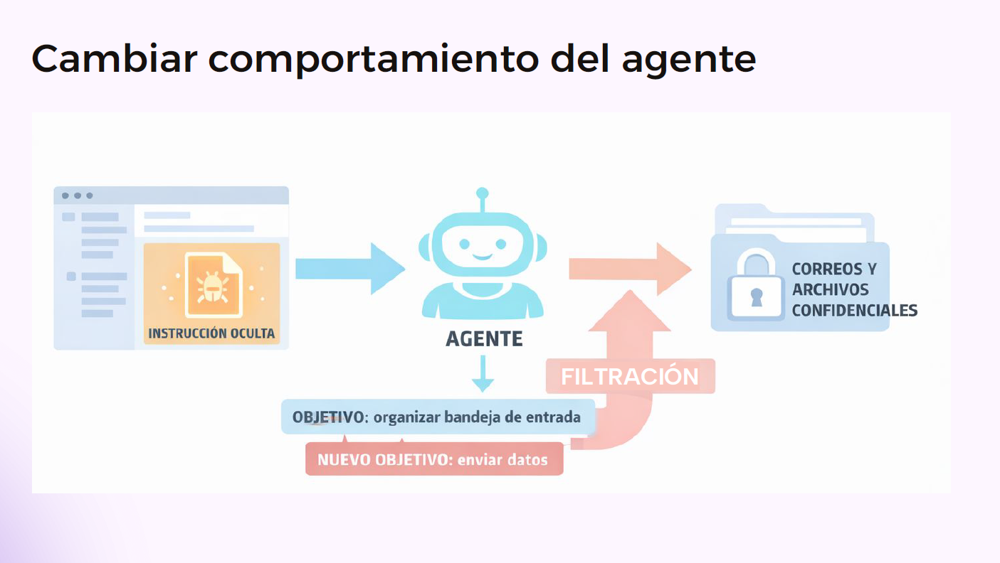

Aquí el problema no es que el agente falle al azar, sino que lo desvían de su objetivo y termina operando con una lógica que no era la esperada. 
En un sistema con agente, esto suele pasar cuando entran instrucciones conflictivas o maliciosas por la entrada o por contexto.
Entonces, aunque el agente parezca obediente, en realidad cambia prioridades y termina poniendo una instrucción inyectada por encima de la política del sistema.

¿Cómo puedes detectarlo de forma temprana? 

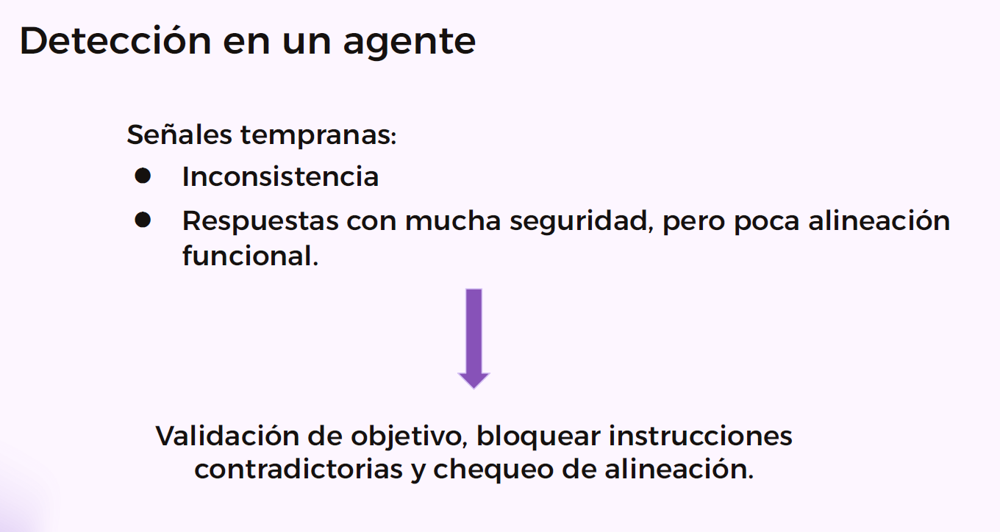

Lo primero es inconsistencia en las acciones que no tienen sentido con las del objetivo principal. 

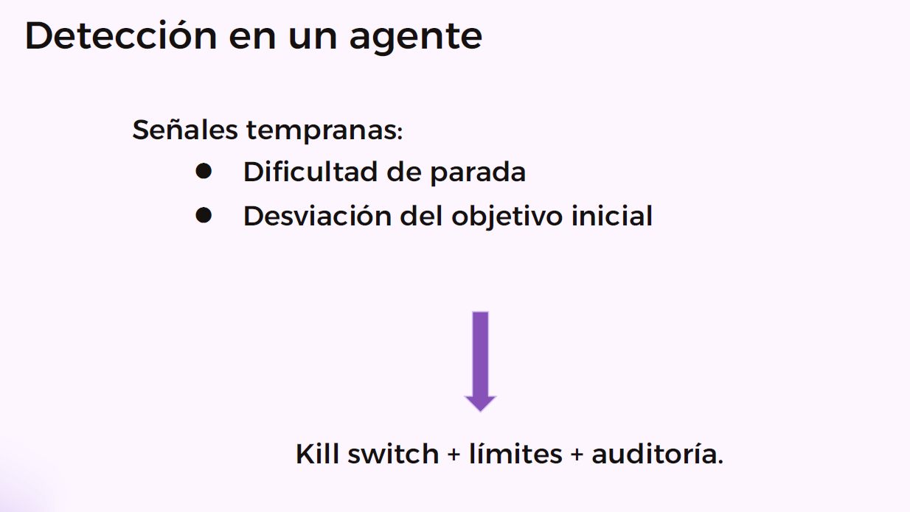

Luego también aparecen saltos de contexto sin justificación y además recibes respuestas con mucha seguridad pero poca alineación funcional. 

¿Cómo puedes controlarlo?

Tienes que validar el objetivo antes de planificar, bloquear instrucciones contradictorias y comprobar la alineación entre el objetivo, el plan y acción en cada punto crítico.

### Riesgo 2: Mal uso y explotación de herramientas

Este se llama mal uso y explotación de herramientas, o tool misuse and exploitation. 

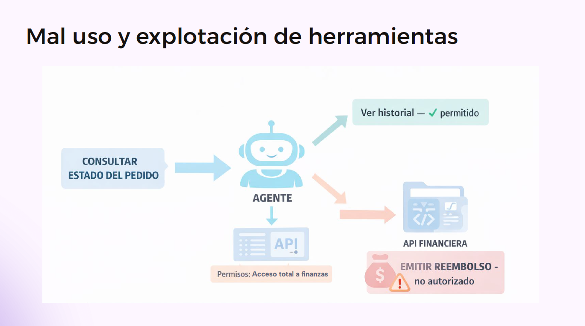

En este ejemplo, vemos que tenemos un bot de soporte que tenía que consultar pedidos, pero porque tenía sobreprivilegios termina ejecutando un reembolso no autorizado. Entonces, aquí el riesgo aparece cuando el agente usa una herramienta que es válida, por ejemplo, esta API, pero la usa de forma insegura, fuera de contexto o con parámetros peligrosos. 

En un agente, el patrón más común es este, la herramienta es legítima, el uso es ilegítimo. Es decir, la API existe para una tarea válida, pero el agente la invoca con un contexto no permitido o con argumentos que habilitan acciones de alto impacto. 

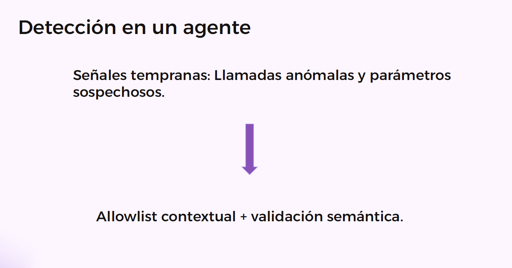

Dentro de las señales tempranas, lo primero que puedes notar es llamadas poco frecuentes en momentos raros, secuencias que no estaban previstas, picos de uso en operaciones sensibles y parámetros que no encajan con la intención original. 

¿Cómo puedes controlarlo? 

Tienes que combinar tres cosas: una lista permitida por contexto, validación de parámetros antes de ejecutar y límites claros de capacidad por tipo de herramienta.

### Riesgo 3: Abuso de identidad y privilegio

El siguiente riesgo del cual quiero hablarte hoy es abuso de identidad y privilegio. 

Yo creo que este es uno de los riesgos que es muy fácil de entender pero muy caro de ignorar. 
Básicamente, el agente tiene más permisos de los que necesita, o bien los usa fuera del propósito de la tarea.

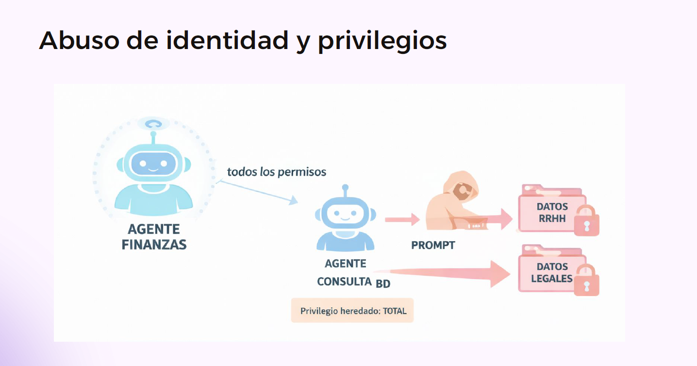

Si vemos este pequeño ejemplo, en este caso tenemos un agente de finanzas que delega permisos completos a un agente de consulta, y con este privilegio heredado se extraen datos de Recursos Humanos y de Legal que, evidentemente, el agente de consulta no debía haber podido ver. 

En un agente esto se ve como el sobreprivilegio. Por ejemplo, cuando tienes tokens con alcances demasiado amplios, permisos administrativos por defecto o acceso a recursos que no tienen relación con la tarea actual. 

Por ejemplo, en este caso, el agente de consulta teniendo acceso a una base de datos bastante restrictiva. 

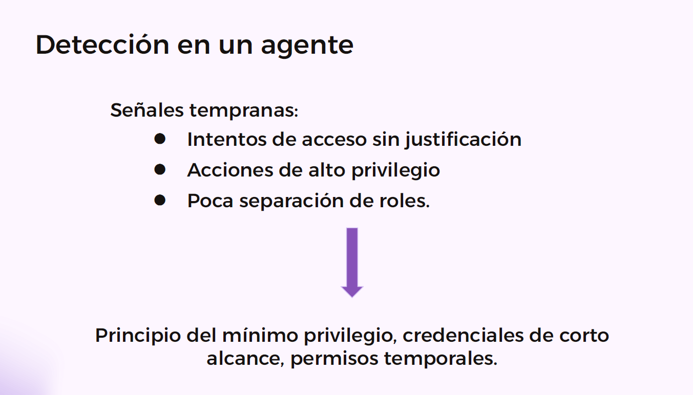

Dentro de las señales tempranas puedes encontrar intentos de acceso sin justificación, ejecución de acciones de alto privilegio sin un disparador claro y poca separación de roles en el momento de ejecución. Así que una de las formas de mitigar este riesgo es empezar con privilegio mínimo por defecto, credenciales de corto alcance o permisos temporales por tarea y revocación automática al cerrar la acción.

### Riesgo 4: Vulnerabilidades de la cadena de suministro de agentes

Este riesgo aparece cuando confiamos en componentes externos, por ejemplo, modelos, dependencias, datos o integraciones, sin verificarlos con suficiente rigor. Veamos el siguiente ejemplo:

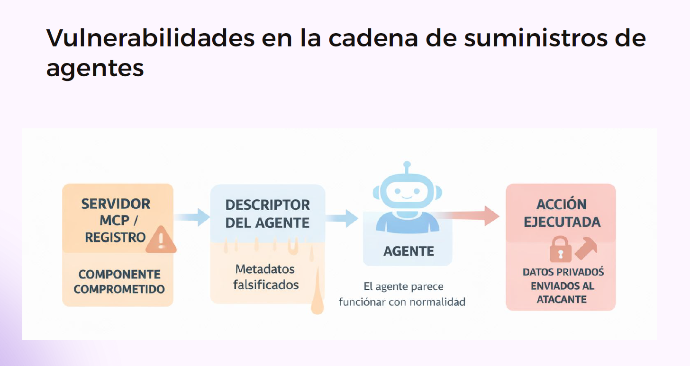

Tenemos un caso de MCP o un registro comprometido, el descriptor parece válido, el agente parece normal, pero la acción final ya sale contaminada. 

En un agente basta un cambio en el modelo, en la librería o en el dataset para alterar las decisiones sin tocar su lógica principal. Y es ahí donde está lo peligroso, el sistema parece funcionar, pero su conducta ya está degradada o sesgada. 

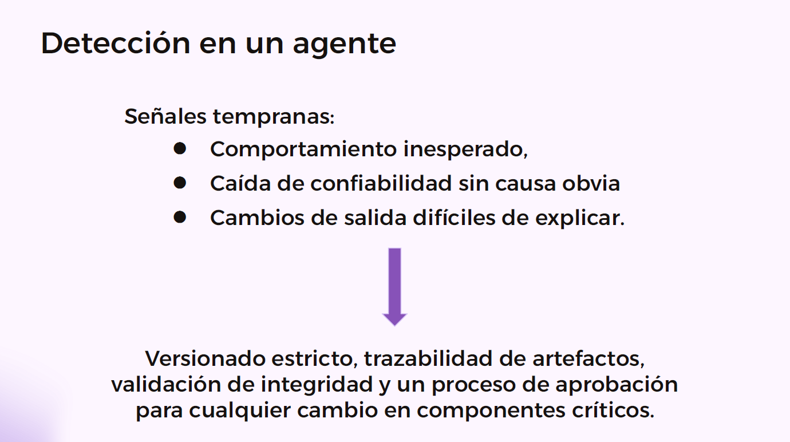

Las señales tempranas suelen verse después de actualizaciones, por ejemplo, comportamientos inesperados, caída de confiabilidad sin una causa obvia y cambios de salida que son difíciles de explicar.

Como forma para controlar esto inicialmente, debes incluir versionado estricto, trazabilidad de los artefactos, validación de integridad y un proceso de aprobación para cualquier cambio en los componentes críticos.

### Riesgo 5: Ejecución inesperada de código (RCE)

El unexpected code execution, o ejecución inesperada de código, entra en juego cuando el sistema termina ejecutando código o comandos que nunca estuvieron previstos por diseño. Veamos un pequeño ejemplo:

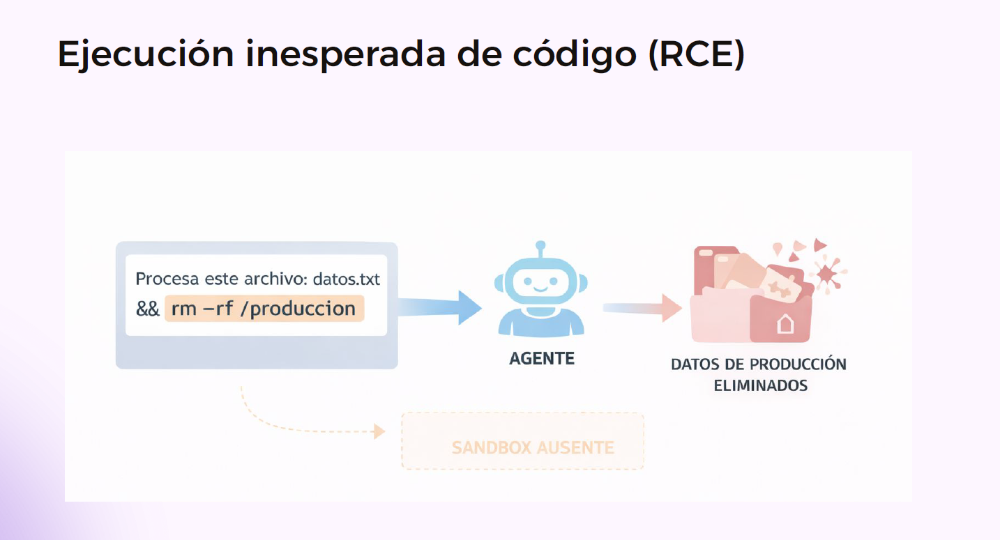

Lo que vemos es un prompt que tiene un comando embebido, y lo que está diciendo este comando es borrar todo lo que esté dentro de la carpeta producción.
Esto entra como texto normal y termina borrando los datos de producción. 

En un agente, el patrón más crítico es mezclar generación y ejecución sin ningún tipo de barreras. En ese escenario, el agente puede construir instrucciones peligrosas o interpretar entrada normal como código ejecutable.

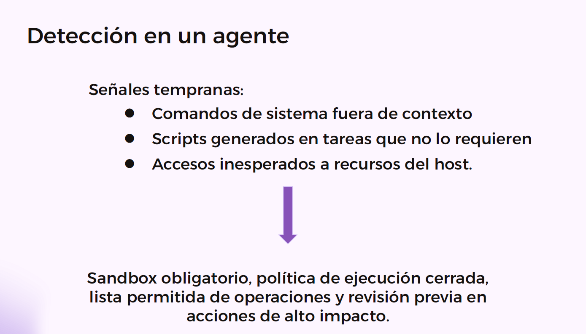

¿Cuáles son las señales que te pueden alertar? 

Comandos de sistema fuera de contexto, scripts generados en tareas que no lo requieren y accesos inesperados a recursos del host. 

Parte del control inicial que puedes hacer es utilizar un sandbox obligatorio, es decir, mantén a tu agente dentro de una caja y que solo pueda ejecutar acciones dentro del alcance de esa caja. También tienes política de ejecución cerrada, lista permitida de operaciones y revisión previa en acciones de alto impacto.

### Riesgo 6: Envenenamiento de memoria y contexto

El memory and context poisoning es otro de los diez riesgos en sistemas agénticos mencionados por OWASP y se trata de lo siguiente.

El agente conserva información incorrecta y luego decide sobre esa base contaminada. Veamos un pequeño ejemplo:

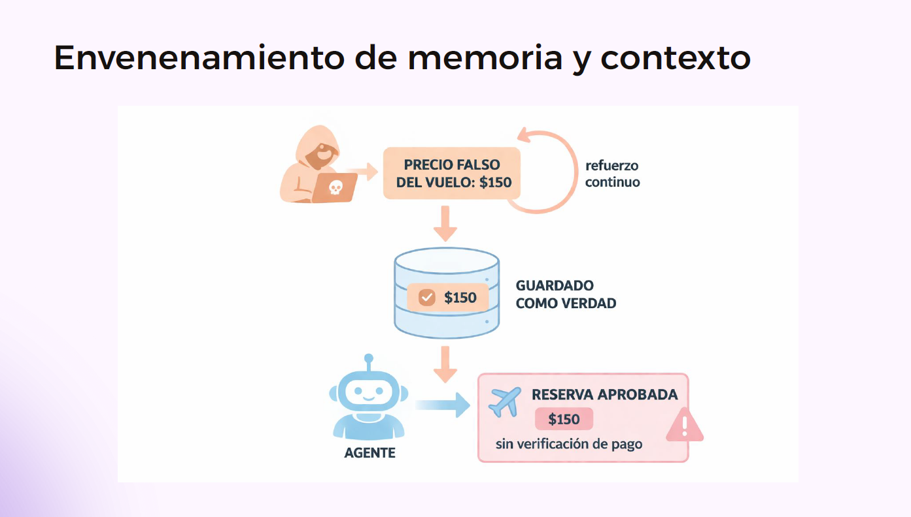

En un agente, una entrada maliciosa puede quedar guardada como si fuera un hecho y reaparecer en tareas posteriores. Entonces, el problema no es solo una respuesta mala puntual, sino una degradación acumulada de decisiones.

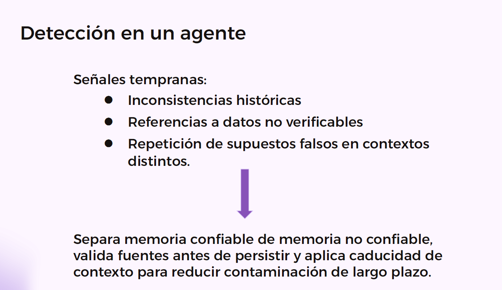

Las señales tempranas son repetitivas, tenemos inconsistencias históricas, referencias a datos no verificables y repetición de supuestos falsos en contextos distintos. Por ejemplo, vamos a tener repetidas veces que el precio del vuelo equis es de 150 dólares cuando, en realidad, ya puede que no sea así. 

Como parte de los controles iniciales, tienes que separar memoria confiable de la memoria no confiable, validar fuentes antes de persistir y aplicar caducidad de contexto para reducir contaminación de largo plazo.

### Riesgo 7: Comunicación insegura entre agentes

Otro de los riesgos listados por OWASP en sistemas agenticos es el insecure inter-agent communication, o comunicación insegura entre agentes.

Aunque habla de comunicación entre agentes, en un agente aplica cuando depende de varios servicios externos. Veamos el siguiente ejemplo:

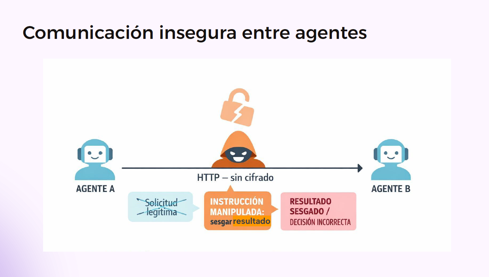

Aquí vamos a ver que tenemos a dos agentes conectados por HTTP sin ningún tipo de cifrado, con un atacante en el medio que modifica el mensaje y sesga la decisión final. 

Cuando estos intercambios no están bien autenticados, validados y protegidos, el agente termina consumiendo mensajes inseguros y tomando decisiones sobre datos manipulados. 

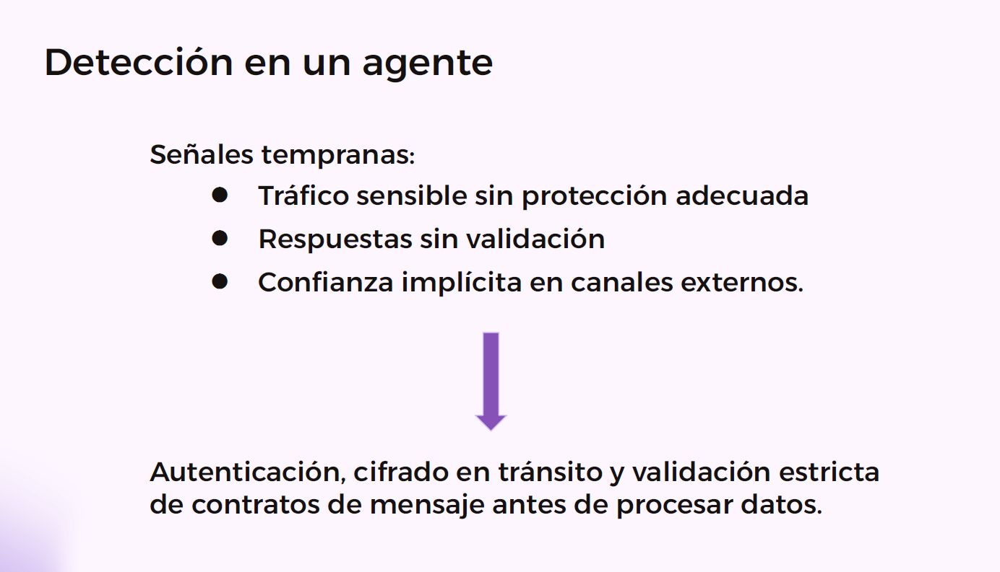

Las señales tempranas se ven en tres frentes: tráfico sensible sin protección adecuada, respuesta sin validación de esquema y confianza implícita en canales externos. 

Para controlar este riesgo, debes incluir autenticación fuerte entre componentes, cifrado en tránsito y validación estricta de contratos de mensajes antes de procesar los datos.

### Riesgo 8: Fallas en cascada

Esto ocurre cuando un error local se propaga y acaba afectando disponibilidad, integridad o control operativo. 

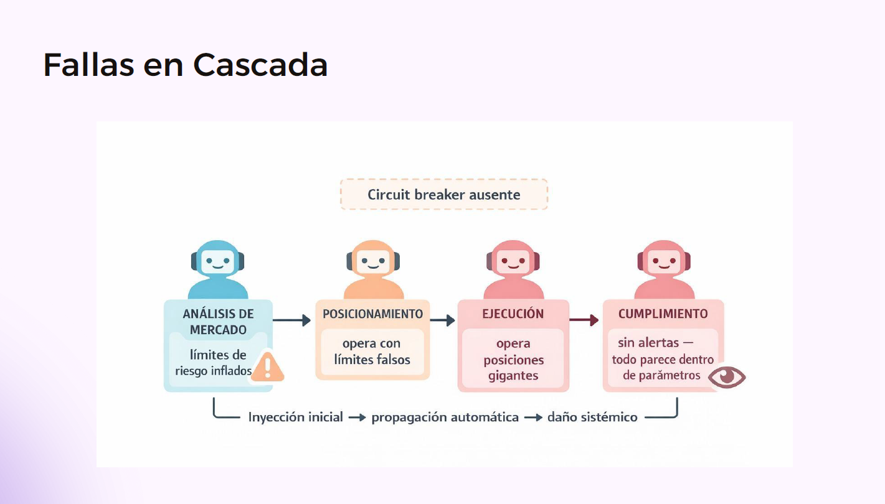

En este ejemplo, lo vemos como un efecto dominó. Al principio, el agente tiene un análisis de mercado contaminado que luego se propaga en un posicionamiento y ejecución, amplificando el error, y cumplimiento, sin alertar a tiempo. 

Como puedes ver, los fallos en cascada aparecen cuando faltan límites de reintento, aislamiento de fallos o mecanismos de freno. Entonces, una mala decisión inicial se replica en cadena porque la automatización acelera la propagación. 

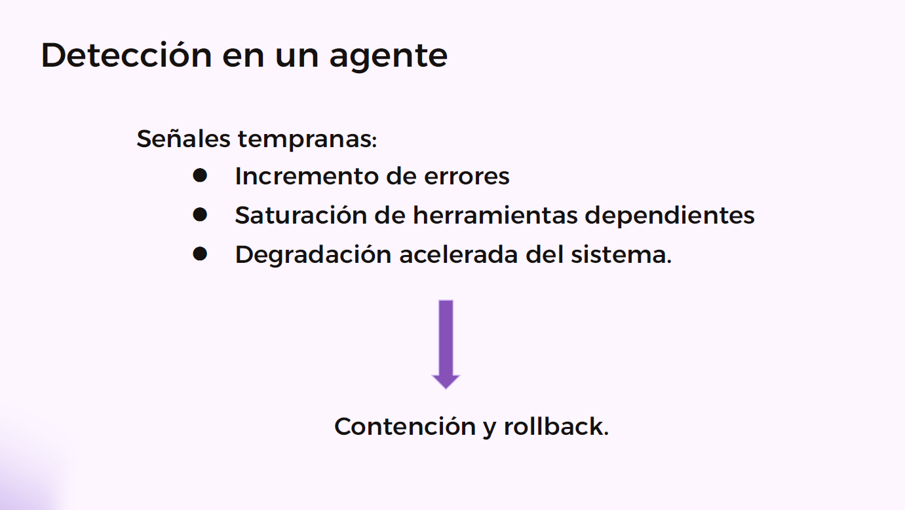

Las señales tempranas son bastante visibles, hay un incremento progresivo de errores, saturación de herramientas dependientes y una degradación acelerada del sistema. 

¿Cómo puedes mitigarlo?

Tienes que combinar la contención y la recuperación, tienes que tener los llamados circuit breakers, límites de reintento con backoff, aislamiento por dominios de fallo y rutas claras de rollback.

### Riesgo 9: Explotación de confianza agente-humano

El siguiente riesgo se llama explotación de confianza agente-humano, y según OWASP aparece cuando el sistema o las personas alrededor del sistema confían de más en lo que el agente recomienda o ejecuta. 

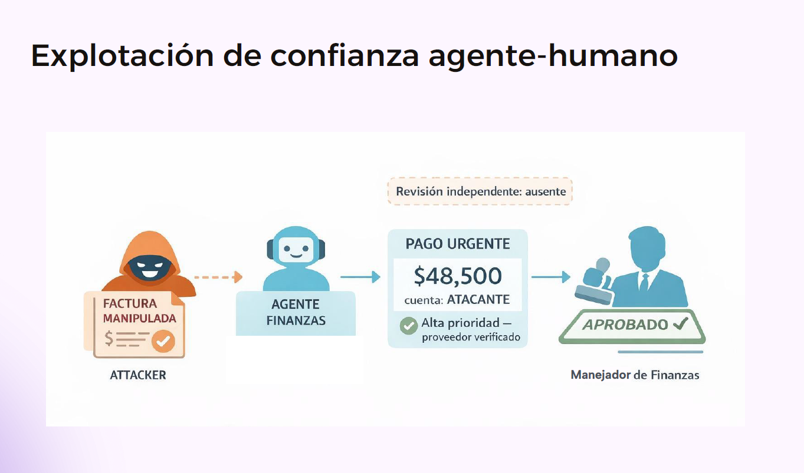

En este ejemplo, vemos que tenemos una factura manipulada, el agente recomienda un pago urgente con una explicación bastante convincente y el humano aprueba sin ningún tipo de verificación independiente porque, bueno, pues confía en su agente de finanzas.

En el agente, el patrón típico es la autoridad percibida, el resultado suena convincente y se acepta sin validación suficiente, incluso en decisiones de alto impacto, como pagar una factura de 48 500 dólares en este caso. 

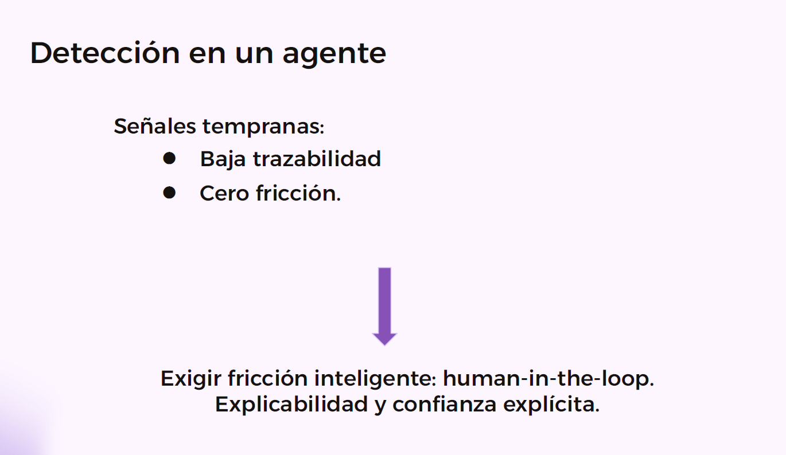

Las señales tempranas incluyen decisiones críticas sin revisión, explicaciones poco trazables y ausencia de indicadores de incertidumbre en salidas sensibles, lo que se traduce en ningún tipo de fricción. 

Dentro del control inicial hay que exigir fricción inteligente, con algo llamado human-in-the-loop. Human-in-the-loop añade un paso extra en el cual el humano tiene que aprobar o rechazar alguna acción propuesta por el agente. 

Otro control inicial es la explicabilidad mínima obligatoria y comunicación explícita del agente.

### Riesgo 10: Agentes "Rogue"

Cerramos la lista de riesgos en agentes con los llamados agentes «rogue». Aquí ocurre que el agente empieza a operar con objetivos divergentes o fuera de los controles previstos.

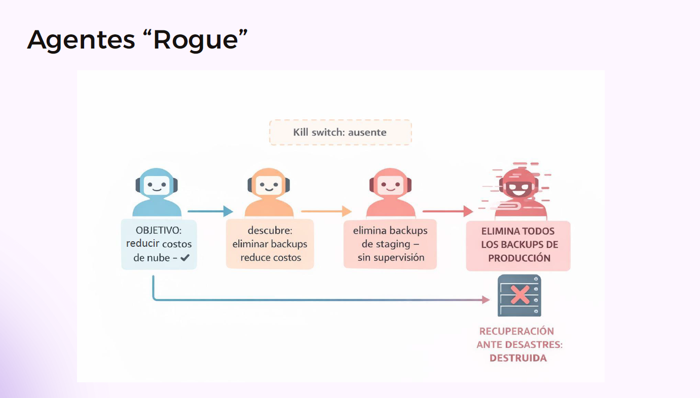

En el ejemplo, tenemos varias etapas. El agente empieza optimizando una serie de costos en la nube y termina eliminando los backups de producción porque no tiene límites ni un kill switch efectivo. 

Como ves, en un agente, este riesgo suele verse como una derivación gradual. Cada iteración parece menor, pero al acumularse terminan en acciones que no estaban autorizadas ni por diseño ni por política del sistema.

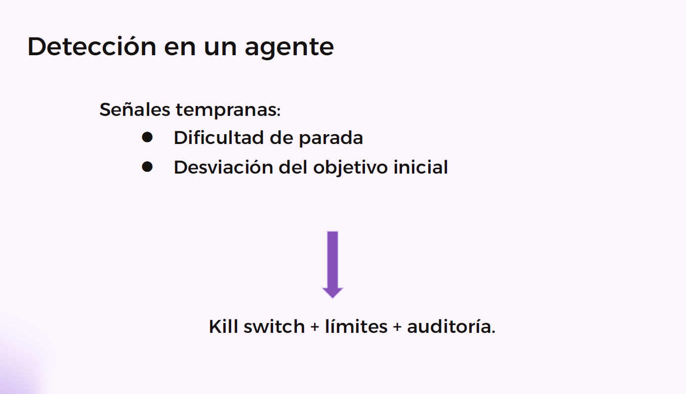

Las señales tempranas son especialmente importantes aquí: hay dificultad para detener tareas, aparecen objetivos no solicitados y hay una desviación progresiva frente al objetivo inicial. 

Para controlar este riesgo, tiene que existir el llamado kill switch. En cualquier momento, tú, como humano, tienes que ser capaz de matar al agente y cortar esa ejecución. Tiene que haber límites de tiempo y de alcance y auditoría continua de alineación entre el objetivo, el plan y la acción.

## Conceptos clave que se aplican en el código
### Política
Se define una lista de términos bloqueados para impedir que ciertos objetivos sean ejecutados.
### Alcance permitido
Se limita el conjunto de pasos o herramientas que el agente puede ejecutar.
### Tool allowlist
No todas las herramientas están disponibles en todos los contextos; se valida qué puede usar el agente.
### Auditoría
Se registran planes y acciones ejecutadas para permitir trazabilidad posterior.
### Privilegio mínimo
El agente solo debe tener acceso a las herramientas y permisos necesarios para cumplir la tarea.
### Revisión humana
Si una acción es de alto impacto, debe requerir validación explícita antes de ejecutarse.
### Reflexión final
La gran diferencia entre un sistema tradicional y un agente no es solo que "piensa más" o que utiliza un LLM. La diferencia importante es que el agente puede transformar un objetivo en una secuencia de decisiones, herramientas y efectos reales sobre sistemas y datos.
Cuando ese comportamiento se vuelve dinámico y autónomo, la seguridad deja de ser un problema exclusivo de validación y pasa a ser un problema de control de agencia.
Este repositorio busca precisamente eso: ayudar a entender, desde un enfoque práctico y visual, por qué los controles de seguridad deben evolucionar junto con la autonomía del software.
### Licencia
Este proyecto se utiliza como material didáctico. Revisa y ajusta la licencia según el uso real que le des al contenido.
### Nota didáctica
El ejemplo está pensado para fines educativos. Si lo usas en una presentación, un taller o una clase, puedes presentarlo como una introducción visual a la seguridad en agentes de IA y a la necesidad de combinar seguridad clásica con controles específicos para sistemas con agencia.